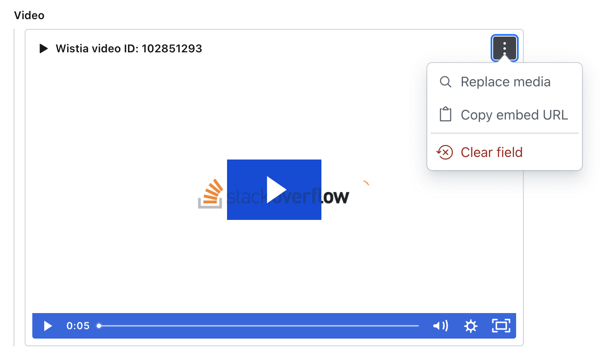

# sanity-wistia-input

> This is a **Sanity Studio v3** plugin.
> 
## What is it?

[Wistia](https://wistia.com/) input plugin for [Sanity](https://sanity.io/) that stores the media ID and hash ID for displaying on the front-end.



## Installation

```sh
npm install sanity-wistia-input
```

## Usage

Add it as a plugin in `sanity.config.ts` (or .js):

```ts
import { defineConfig } from 'sanity'
import { wistiaInput } from 'sanity-wistia-input'

export default defineConfig({
  //...
  plugins: [
    wistiaInput({
      token: '<your token here>'
    }),
  ],
})
```

## Data model

```js
{
	id: 123456,
	hashed_id: 'abc123'
}
```

## License

[MIT](LICENSE) © David Longworth. WISTIA is a trademark of Wistia, Inc. and has no affiliation with this project.

## Develop & test

This plugin uses [@sanity/plugin-kit](https://github.com/sanity-io/plugin-kit)
with default configuration for build & watch scripts.

See [Testing a plugin in Sanity Studio](https://github.com/sanity-io/plugin-kit#testing-a-plugin-in-sanity-studio)
on how to run this plugin with hotreload in the studio.
